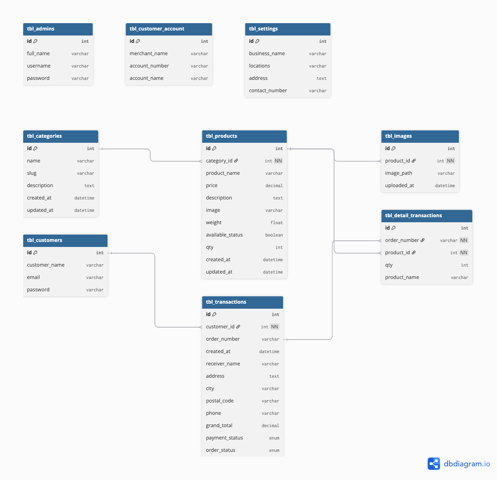

# ShopHub Gadget Store - Codeigniter 3 Application

Codeigniter 3 with Bootstrap 5 Online Shop Platform with Stripe, API, and Admin CMS Integrations 

Current versions:

* Codeigniter 3.1.13 (CodeIgniter Foundation)
* Bootstrap 3.3.7

## 🏗️ Project Architecture

This project follows a MVC architecture with the following main components:

- **MVC with Migrations & Seeders** 
- **Composer Support** - Easy to Install additional Package
- **JWT**
- **Stripe Integration**
- **AdminLTE UI**
- **Professional Ready Template (UI Landing Page)**
- **Email Integrations**
- **Invoice PDF**
- **API Access**
- **Authentication & Authorization** - Login for Customer & Admin user
- **Assets Management** - Products, Category, Orders, General Setting Pages

## 🚀 Technology Stack

- **Language**: PHP 7.3 ~ 7.4
- **Framework**: Codeigniter 3 framework
- **Database**: Mysql 8.0
- **Migrations**: 
- **Stripe Integrations**: 
- **Docker**: Soon

## 🌱 Database Seeding

The project includes a comprehensive File database seeder for migrating Master/Dummy data:

# Quick start 
Run Migration	http://localhost/[project_title]/migrate
Rollback Migration	http://localhost/[project_title]/migrate/rollback
Migrate to version X	http://localhost/[project_title]/migrate/version/5
Fresh (reset + migrate + seed)	http://localhost/[project_title]/migrate/fresh
Run Seeder	http://localhost/[project_title]/seeder
Run Seeder specific file	http://localhost/[project_title]/seeder/run/ProductSeeder

## 📋 1 Installation & Setup
Before setting up the project, ensure you have the following installed:

- **PHP 7.3 ~ 7.4** 
- **Mysql 8.0**
- **Nginx / Apache Installation**
- **Composer Installation**
- **Git** - [Download](https://git-scm.com/downloads)

alternative
**Laragon, XAMPP, Servbay**
**Docker & Docker Compose Installation (soon)** 

### Installation Flow
### 1. Git Clone  the Repository
Clone this repository.

### 2. Run Composer Install
Run composer Install to built package

### 4. Run Migrate & Seeder Database (Must!)
Run Migration	http://localhost/[project_title]/migrate
Run Seeder	http://localhost/[project_title]/seeder

### 5. Setup Sripe & Email Key
Make sure to update stripe & email key (consider to replace or I would like to provide testing key by private chat)

### 6. Open Landing page & Login 
access to http://localhost/[project_title] or using local domain (need to setup on nginx - eg. shophub.test)
direct to http://localhost/[project_title]/login, use dummy data that show on top form
try to add cart, checkout and recieved notifications

### 7. Open Admin & Login
access to http://localhost/[project_title]/admin or using local domain (need to setup on nginx - eg. shophub.test)
login using dummy data
open dashboard to check orders, products, categories, customer and others menu

## 🗄️ 2 Database Management

### Database Migrations

ERD Diagram and relations can see on this link :
https://dbdiagram.io/d/693d6473e877c63074b35015

## 🔒 3 Authentication & Authorization

To ensure users can perform only authorized tasks
The system will implements role-based access control (RBAC) with:

Assign roles/permissions:
✔️ Admin — full access
✔️ Editor — limited editing
✔️ User/Customer — view only

- **JWT Authentication**: Secure token-based authentication
- **Role Management**: Hierarchical role system
- **Permission System**: Granular permission control

## 📡 4 API Documentation

The server exposes a REST API with the following main endpoints and consideration points:

- Versioning: /api/v1/
- Use REST controllers
- Standard methods: GET, POST, PUT, DELETE
- JWT (JSON Web Tokens)
- pagination (Manage Big Data load), CORS, Rate limiting and Documenation 

### Base URL: `http://localhost:8080/api`

#### Core Modules

- **Authentication**: `/api/auth/login|logout|refresh|verify|check`
	- User login/logout
  - get JWT/token
	- refresh,verify and check JWT/token

- **Product list** : `/api/products|categories`
	- product list
	- product search
	- categories

- **Profile** : `/api/user/profile`
	- profile detail

## 📊 5 Deployment Strategy

### Containerization
- Use Docker (soon)
- Implement Sonarqube (soon)

### Staging Environtment
- github actions (soon)
- Cloud VPS or AWS/GCP

### Production 
- AWS/GCP
- Devops
- Grafana/Logging

## 🔧 6 Development Tools

Current:
- **Boostrap 5**
- **Composer Support** - Easy to Install additional Package
- **JWT**
- **Stripe Integration**
- **AdminLTE UI**
- **Professional Ready Template (UI Landing Page)**
- **Email Integrations**
- **Invoice PDF**
- **API Access**
- **Authentication & Authorization** - Login for Customer & Admin user

Future : 
- **Docker**
- **RBAC**
- **Swagger**
- **Github Actions**
- **Sonarqube**
- **grafana**
- **OAuth2 for social media acccess**
- **Stripe Extend Payment Method**
